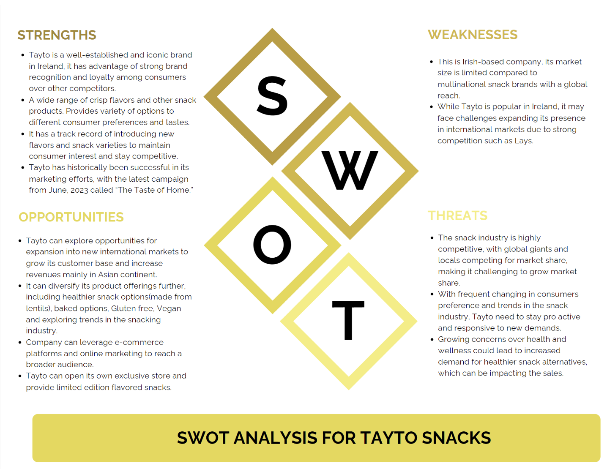
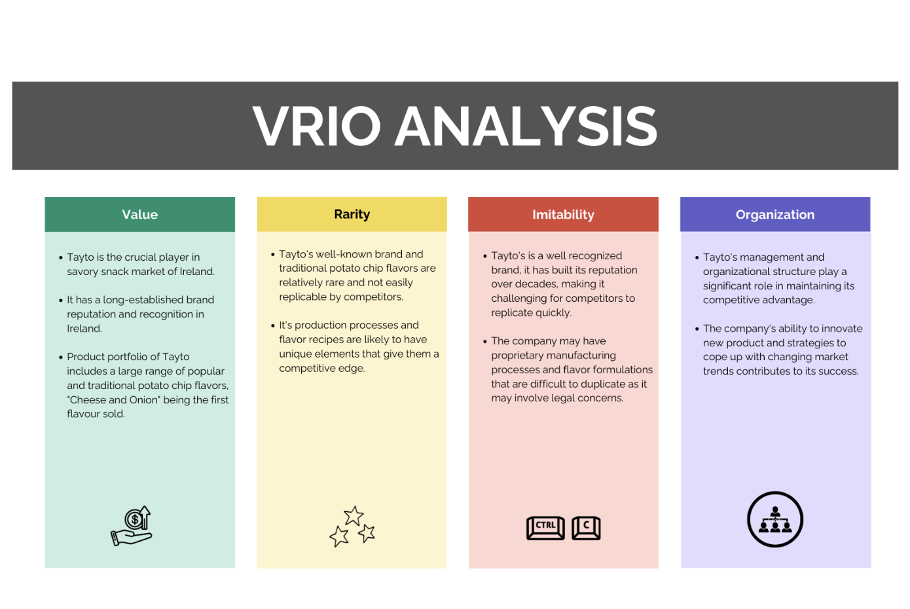
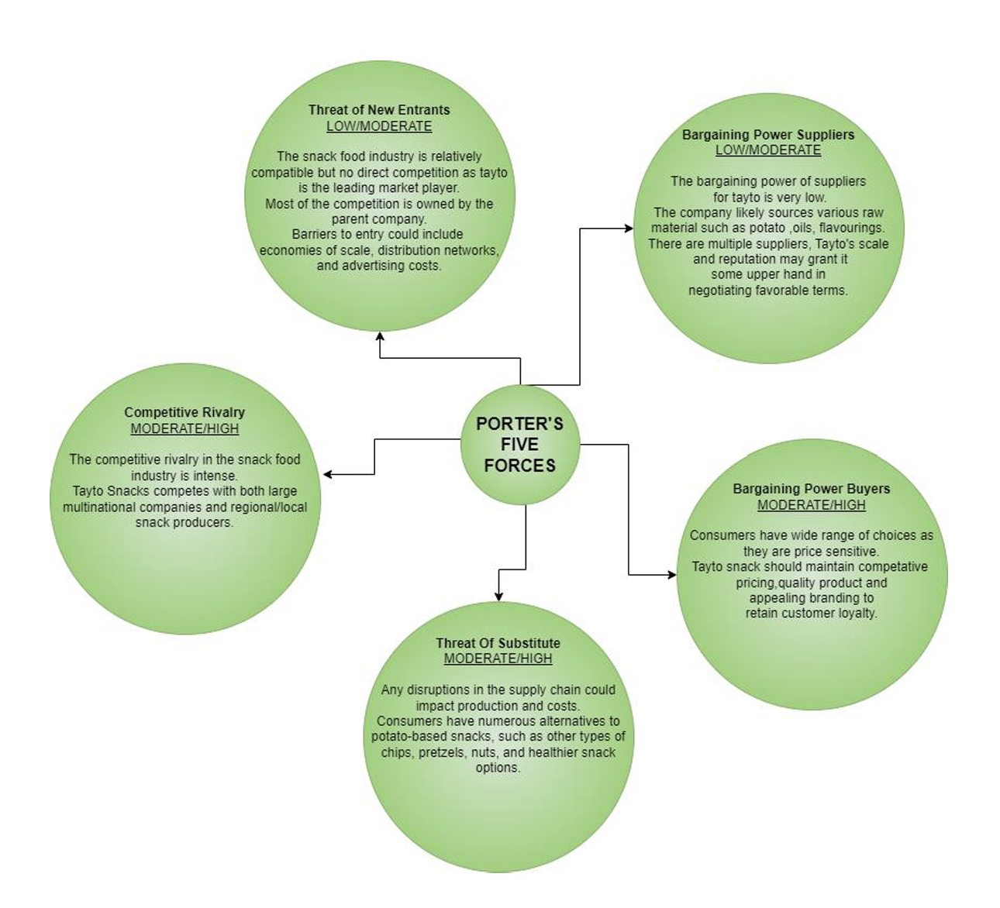
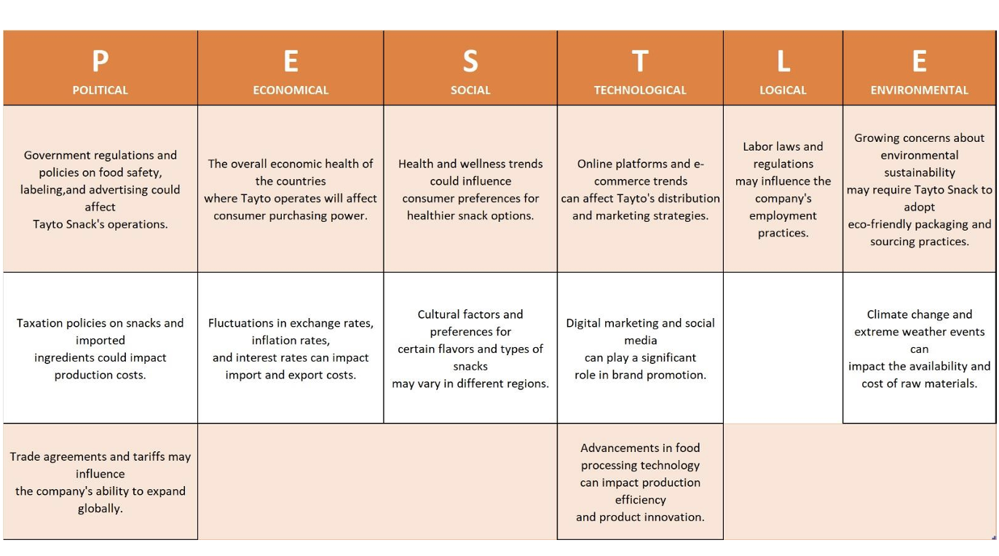
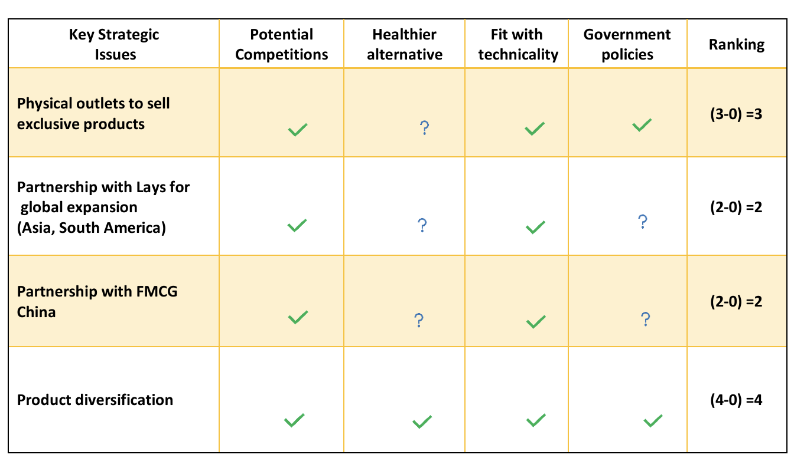
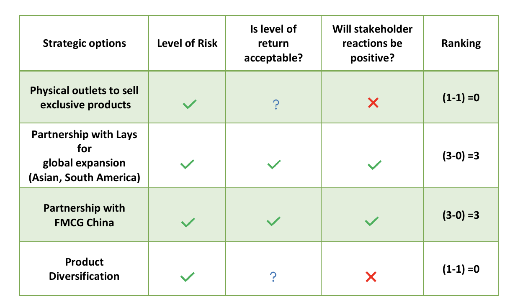
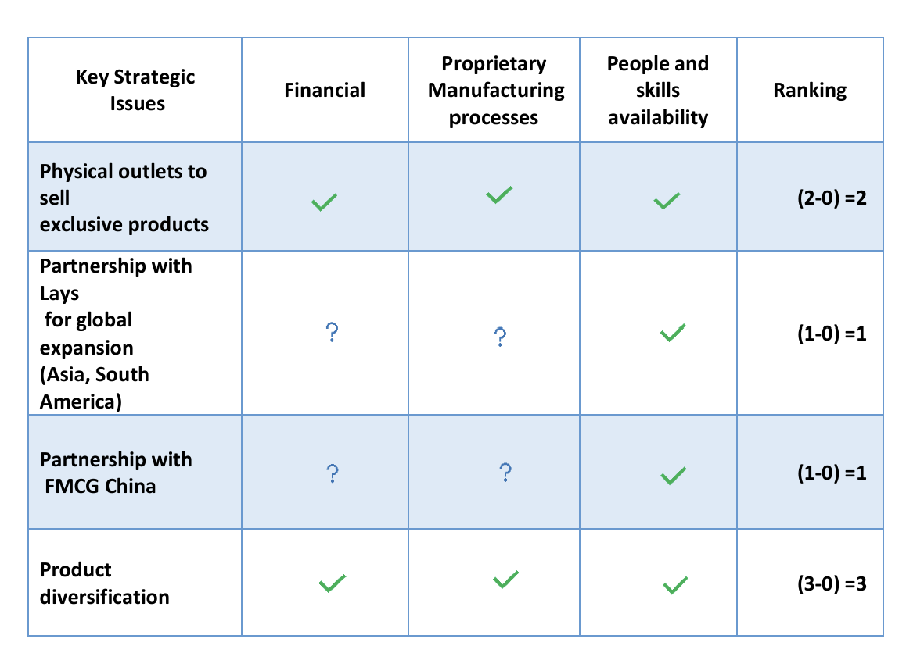
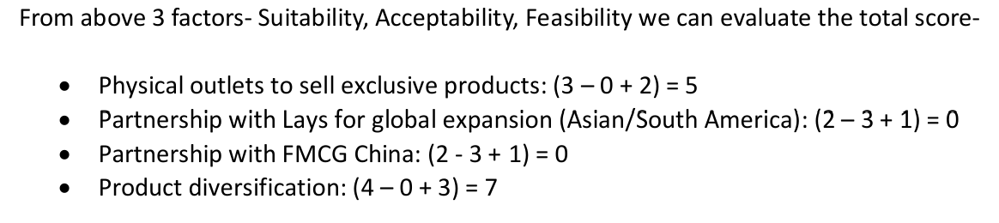

# Tayto Snacks - Business Strategy Analysis

## 📋 Project Overview

This comprehensive business strategy report analyzes **Tayto Snacks**, Ireland's most iconic crisp brand, and provides strategic recommendations for global expansion. The study employs multiple strategic frameworks to evaluate Tayto's current market position and identify growth opportunities beyond the Irish market.

## 🎯 Project Objectives

The primary objectives of this strategic analysis are to:

1. Conduct comprehensive internal and external analysis of Tayto Snacks
2. Identify strategic opportunities for global market expansion
3. Evaluate potential growth strategies using proven frameworks
4. Provide actionable recommendations for international expansion
5. Assess risks and feasibility of proposed strategies

## 🏢 About Tayto Snacks

### Company History

**Founded:** May 1954 by Joe Murphy in Dublin, Ireland

**Key Milestones:**
- **1955** - Introduced world's first cheese and onion flavoured crisp
- **1960s** - Large-scale expansion with new facilities in Harold's Cross
- **1968** - Opened first potato storage facility in Stamullen, Co. Meath
- **1970s** - Relocated to larger production site in Coolock
- **1990s** - Modernized Coolock plant and built new distribution facility
- **2000s** - Launched "Honest" brand for health-conscious consumers
- **2016** - Participated in Food Hotel China exhibition for international expansion

### Current Market Position

- Ireland's favorite crisp and snacks brand
- Strong household recognition and brand loyalty
- Consistently voted most-missed Irish product by ex-pats globally
- Multiple brand portfolio including Tayto, King, Hunky Dorys, Hula Hoops, and more

### Product Portfolio

**Current Flavors:**
- Cheese & Onion
- Salt & Vinegar
- Smokey Bacon
- Prawn Cocktail
- Tex Mex (limited edition)

**Brand Portfolio:**
Tayto, King, O'Donnells of Tipperary, Hunky Dorys, Hula Hoops, Popchips, KP, Penn State, Pom-bear, McCoy's

## 🔍 Strategic Analysis Frameworks

This study employs multiple proven strategic frameworks:

### Internal Analysis

#### 1. SWOT Analysis
Comprehensive evaluation of:
- **Strengths** - Strong brand recognition, loyal customer base, quality products
- **Weaknesses** - Limited international presence, market concentration in Ireland
- **Opportunities** - Global expansion, product diversification, health-conscious market
- **Threats** - Intense competition, changing consumer preferences, economic factors

#### 2. VRIO Framework
Assessment of internal resources based on:
- **Value** - Does it provide customer value?
- **Rarity** - Is it rare among competitors?
- **Imitability** - Is it difficult to imitate?
- **Organization** - Is the company organized to exploit it?

### External Analysis

#### 3. Porter's Five Forces
Analysis of competitive environment:
- Threat of new entrants
- Bargaining power of suppliers
- Bargaining power of buyers
- Threat of substitute products
- Competitive rivalry intensity

#### 4. PESTEL Analysis
Macro-environmental factors evaluation:
- **Political** - Trade policies, regulations
- **Economic** - Market conditions, consumer spending
- **Social** - Health trends, lifestyle changes
- **Technological** - Innovation, automation
- **Environmental** - Sustainability initiatives
- **Legal** - Food safety regulations, labeling requirements

## 💡 Strategic Recommendations

### Recommendation Evaluation: SAFE Framework

All strategic options were evaluated using the SAFE framework:
- **Suitability** - Alignment with organizational goals
- **Acceptability** - Stakeholder support and risk levels
- **Feasibility** - Resource availability and implementation capability
- **Effectiveness** - Expected outcomes and objectives achievement

### Strategic Options Analyzed

#### Option 1: Strategic Partnership with Global Players
- Partner with Lay's or Chinese FMCG companies
- Target markets: Asia and South America
- Leverage existing distribution networks
- **SAFE Score:** 0 (High risk, acceptability concerns)

#### Option 2: Product Diversification ⭐ **RECOMMENDED**
- Introduce healthier crisp variants
- Develop innovative flavors
- Target health-conscious consumers
- Align with global wellness trends
- **SAFE Score:** 7 (Highest viability)

#### Option 3: Physical Retail Stores ⭐ **RECOMMENDED**
- Establish exclusive Tayto outlets
- Create immersive brand experiences
- Offer limited-edition products
- Direct consumer engagement
- **SAFE Score:** 5 (Strong potential)

## 🎯 Final Recommendations

Based on comprehensive analysis, we recommend:

### 1. Product Diversification (Priority 1)
**Rationale:**
- Highest SAFE score (7/10)
- Aligns with health and wellness trends
- Attracts broader international audience
- Manageable implementation risks
- Strong potential ROI

**Implementation Steps:**
- Develop healthier snack alternatives (low-fat, low-salt)
- Introduce unique and innovative flavors
- Target health-conscious consumer segments
- Maintain brand identity while innovating

### 2. Physical Store Expansion (Priority 2)
**Rationale:**
- Strong SAFE score (5/10)
- Creates unique brand experiences
- Differentiates from competitors
- Builds customer loyalty
- Provides direct market feedback

**Implementation Steps:**
- Establish flagship stores in key markets
- Create exclusive product offerings
- Design immersive shopping experiences
- Gather customer insights and feedback

## 📊 Key Insights

### Strengths
- 70+ years of heritage and brand recognition
- Strong R&D capabilities (first cheese & onion crisp)
- Loyal Irish customer base
- Diverse product portfolio
- Sustainability initiatives

### Opportunities
- Growing global snacks market
- Health-conscious consumer trends
- International expansion potential
- E-commerce and direct-to-consumer channels
- Product innovation possibilities

### Challenges
- Intense market competition
- Limited international presence
- High entry barriers in new markets
- Changing consumer preferences
- Resource constraints for global expansion

## 📈 Market Potential

### Target Markets Identified
- **Asia** - Particularly China with world's biggest food market
- **South America** - Emerging middle-class consumer base
- **European Union** - Existing proximity and trade relationships
- **North America** - Large Irish diaspora community

## 🔄 Sustainability Initiatives

Tayto's commitment to environmental responsibility:
- Eco-friendly packaging materials
- Optimized energy consumption
- Recycling initiatives
- Sustainable sourcing practices

## 📚 Research Methodology

### Data Collection
- Company historical records and reports
- Market research and competitor analysis
- Industry publications and news articles
- Strategic framework applications
- Academic business strategy principles

### Analysis Process
1. Internal capability assessment
2. External environment evaluation
3. Strategic options identification
4. SAFE framework evaluation
5. Recommendation formulation

## 👨‍💼 Stakeholder Considerations

### Key Stakeholders
- Management and executives
- Employees and workforce
- Irish consumers and loyal customers
- International market consumers
- Suppliers and partners
- Investors and shareholders
- Regulatory bodies

## 🚀 Implementation Timeline

**Phase 1: Planning (Months 1-3)**
- Finalize product development strategy
- Identify initial store locations
- Secure necessary resources

**Phase 2: Development (Months 4-9)**
- Develop healthier product variants
- Design store concepts and experiences
- Establish supply chain partnerships

**Phase 3: Launch (Months 10-12)**
- Pilot product launches
- Open flagship stores
- Marketing campaigns

**Phase 4: Expansion (Year 2+)**
- Scale successful initiatives
- Enter new international markets
- Continuous improvement

## 📖 Report Structure

1. **Executive Summary** - Overview and key recommendations
2. **Introduction** - Company background and history
3. **Internal Analysis** - SWOT and VRIO frameworks
4. **External Analysis** - Porter's Five Forces and PESTEL
5. **Recommendations** - SAFE analysis and strategic options
6. **Conclusion** - Final recommendations and rationale
7. **Appendices** - Meeting records and references

## 🔬 Key Acquisitions History

- **1964** - Beatrice Foods (Chicago)
- **1972** - King Crisps
- **1981** - Smith's Food Group Factory
- **2006** - Acquired by Largo Food Exports Limited

## 📝 Academic Context

This project was completed as part of the Business Strategy module, demonstrating application of:
- Strategic analysis frameworks
- Market evaluation techniques
- Competitive positioning strategies
- International expansion planning
- Risk assessment methodologies

## 🎓 Learning Outcomes

Through this project, the team gained expertise in:
- Strategic business analysis
- Framework application (SWOT, VRIO, Porter's, PESTEL, SAFE)
- Market research and evaluation
- Strategic recommendation development
- Collaborative teamwork and project management
- Business report writing and presentation

## 📚 References

Comprehensive references include:
- Irish Times articles and business reports
- Competition and Consumer Protection Commission documents
- Market research from Statista
- Industry publications and news sources
- Academic business strategy literature

See Appendix 2 for complete reference list.

## 🤝 Team Collaboration

**Total Estimated Project Hours:** 1,920 minutes (480 minutes per team member)

**Meeting Schedule:**
- 9 formal team meetings conducted
- Library room bookings documented
- Clear task allocation and deadlines
- Regular progress reviews and discussions

## 📧 Contact Information

For queries regarding this strategic analysis:

- Sudhanshu Akarshe: 20000762
- Pranita Nanekar: 20000809
- Kunal Bhoite: 20000769
- Kajal Pawar: 20001279

---

## 🏆 Conclusion

This strategic analysis provides Tayto Snacks with a clear roadmap for global expansion through product diversification and physical retail presence. By leveraging its strong brand heritage while adapting to modern consumer trends, Tayto is well-positioned to become a leading international snacks brand.

**Key Takeaway:** *"From Ireland's favorite to global favorite - Tayto's journey continues through strategic innovation and consumer-centric expansion."*

---

**Disclaimer:** This report was prepared for academic purposes as part of a Business Strategy module. All analyses and recommendations are based on publicly available information and strategic frameworks taught in the course.

*Mr. Tayto has something for everyone - now globally!* 🥔🌍